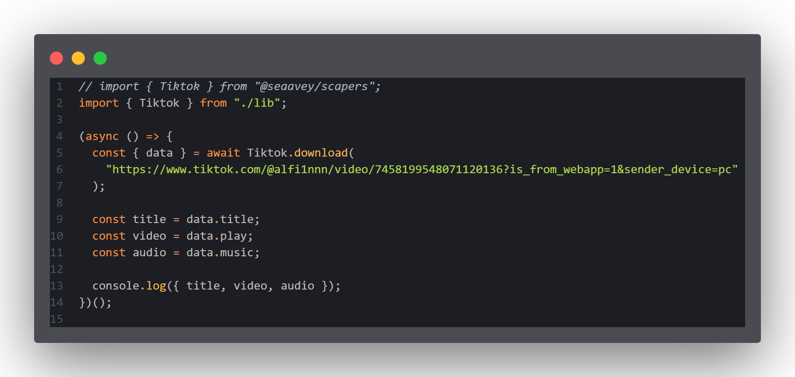

# 🌟 Scraping Library By Seaavey Team

Welcome to **Scraping Library**! This repository contains a collection of tools and utilities designed to simplify interactions with various APIs and platforms. Whether you're working with anime data, social media content, or web scraping, this project has got you covered!

## 🛠 Installation

To use this project, follow these steps:

1. **Clone the Repository**:

   ```bash
   git clone https://github.com/seaavey/scapers
   cd scapers
   ```

2. **Install Dependencies**:
   Make sure you have Node.js installed, then run:

   ```bash
   npm install
   ```

3. **Run the Code**:
   ```bash
   node index.js
   ```

## 📚 Usage

This project is designed to be modular and easy to use. Each module is self-contained and can be imported and used independently.



## License

This project is licensed under the MIT License - see the [MIT](https://github.com/seaavey/scapers/blob/main/LICENSE) file for details.

## 🤝 Contributing

Contributions are welcome! If you'd like to contribute to this project, please follow these guidelines:

1. Fork the repository.
2. Create a new branch for your feature or bug fix.
3. Make your changes and commit them.
4. Push your changes to your fork.
5. Create a pull request to the main repository.

## 📧 Contact

If you have any questions or need further assistance, feel free to reach out to us:

- Email: seaavey@gmail.com
- GitHub: Seaavey

## 🙏 Thanks To

- **Seaavey Team** - For development and support
- **Open-source Contributors** - For improving this project
- **All Users & Testers** - For feedback and suggestions

## Collaborators

- [Kaviaann](https://github.com/Kaviaann)
- [SxyzVerse](https://github.com/SxyzVerse)

## 📞 Contact Us

For support or inquiries, reach out to us:

- 🌐 [Website](https://seaavey.biz.id)
- ✉️ Email: seaavey@gmail.com
- 📢 Follow us on [Whatsapp Channel](https://whatsapp.com/channel/0029Vb49mcTEgGfJRWTyuz35)

---

Made with ❤️ by **Seaavey Team**
